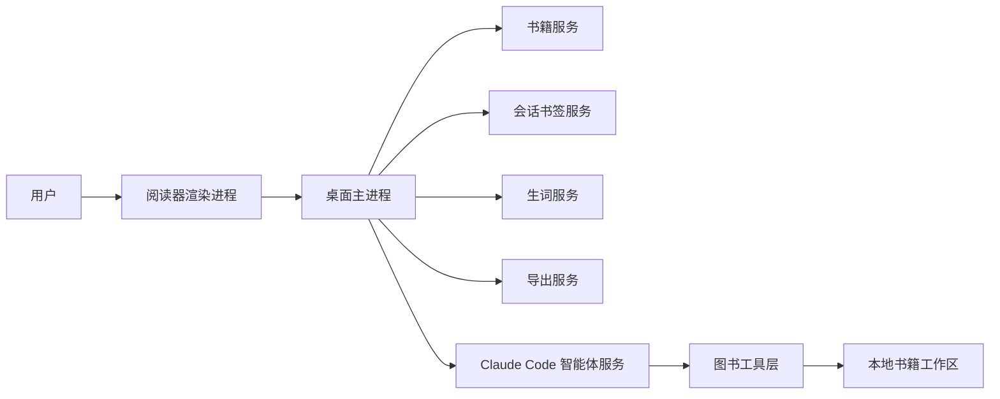

# 图书智能伴读器技术架构

状态：草案
最后更新：2026-05-29
关联需求：[图书智能伴读器产品需求文档](/Users/limuyu/work/muyu-claw-team/docs/图书智能伴读器产品需求文档.md)

## 一、架构目标

本架构的目标是把“图书阅读器 + 智能伴读侧边栏 + 会话书签 + 生词本 + 导出”拆成边界清晰、可测试、可逐步替换的模块。

关键约束：

1. 右侧智能伴读侧边栏使用 Claude Code 作为智能体底座。
2. 智能体只能通过受控工具访问书籍上下文，不能随意读取用户文件。
3. 书籍、会话、生词、笔记和导出结果默认存储在本地。
4. 代码按职责拆分，单个文件只负责一个清晰模块，避免巨型文件。
5. 第一阶段必须能本地运行，先完成可用闭环，再逐步补强格式解析和多模态能力。

## 二、推荐技术栈

### 2.1 桌面应用层

推荐使用 Electron 作为第一版桌面壳：

- 与当前仓库 TypeScript/Node.js 技术栈一致。
- 可以直接复用 Claude Code 运行时、文件系统、进程管理和本地工作区能力。
- 能较快交付一个可运行的苹果电脑应用。
- 后续如果需要更原生体验，可以把业务层保留，替换为 SwiftUI 前端。

第一版不直接使用 SwiftUI，是因为 Claude Code 运行时、书籍工作区和本地工具调用都更贴近 Node.js 生态。使用 Electron 能降低端到端产品验证成本。

### 2.2 智能体运行时

使用 Claude Code 或 `@anthropic-ai/claude-agent-sdk` 作为智能体底座。

运行时职责：

- 接收用户问题。
- 接收当前阅读上下文。
- 通过受控工具查询书籍内容。
- 生成解释、翻译、总结、思考问题和笔记。
- 返回结构化结果，供应用保存为会话书签、生词或笔记。

### 2.3 本地存储

第一版使用文件系统存储，不引入数据库。

原因：

- 读书应用初期数据结构简单。
- 便于用户备份和导出。
- 便于 Claude Code 运行时在受控工作区内读取。
- 后续可在不改变上层接口的情况下替换为 SQLite。

### 2.4 阅读格式支持

第一阶段已纳入四类导入：

1. EPUB：解析元数据、阅读顺序、章节标题和正文。
2. 文本型 PDF：提取 PDF 字符串文本并作为可阅读章节导入。
3. 纯文本：按正文导入。
4. 标记文档：按一级标题拆分章节。

EPUB 章节中的图片替代文本和图注会作为图片上下文进入阅读页和智能体提示词。扫描版 PDF、复杂版式 PDF、图片 OCR 和真实视觉理解属于下一阶段能力。

## 三、顶层进程模型



### 3.1 渲染进程

负责用户界面：

- 书籍列表。
- 阅读界面。
- 文本选择。
- 高亮显示。
- 右侧智能伴读侧边栏。
- 会话列表。
- 生词本。
- 导出按钮。

渲染进程不能直接访问任意文件系统，只能通过桌面主进程暴露的接口调用业务能力。

### 3.2 桌面主进程

负责系统能力：

- 创建应用窗口。
- 暴露安全的进程间通信接口。
- 调用书籍、会话、生词、导出和智能体服务。
- 维护用户数据目录。

### 3.3 智能体进程

智能体服务可以用两种方式运行：

1. 通过 Claude Code 命令或 SDK 启动无界面会话。
2. 在开发或未配置 Claude Code 时，使用本地规则模拟器，保证产品仍可运行和测试。

模拟器不是最终产品能力，但能保证开发机没有 Claude Code 凭据时，阅读、会话、生词、导出流程仍然可验证。

## 四、目录结构

新增应用放在独立目录，避免污染现有多用户智能体服务：

```text
apps/book-agent-reader/
  package.json
  tsconfig.json
  src/
    agent/
      book-agent-system.ts
    main/
      main.ts
      ipc.ts
      preload.ts
    domain/
      book.ts
      chapter-summary.ts
      highlight.ts
      session.ts
      vocab.ts
      agent.ts
    services/
      book-store.ts
      book-importer.ts
      reading-context.ts
      highlight-store.ts
      chapter-summary-store.ts
      session-store.ts
      vocab-store.ts
      markdown-exporter.ts
      skill-exporter.ts
      claude-code-agent.ts
      mock-agent.ts
    server/
      server.ts
    renderer/
      index.html
      styles.css
      app.js
  resources/
    skills/
      book-reading/
        SKILL.md
  tests/
    app-service-import.test.ts
    book-importer.test.ts
    exporter.test.ts
    format-importer.test.ts
    highlight-summary.test.ts
    library-search.test.ts
    reading-context.test.ts
    session-and-vocab.test.ts
```

根目录只新增少量脚本：

```json
{
  "scripts": {
    "book:dev": "npm --prefix apps/book-agent-reader run dev",
    "book:web": "npm --prefix apps/book-agent-reader run web",
    "book:test": "npm --prefix apps/book-agent-reader test",
    "book:typecheck": "npm --prefix apps/book-agent-reader run typecheck"
  }
}
```

## 五、模块职责

### 5.1 桌面壳

文件：

- `src/main/main.ts`
- `src/main/ipc.ts`
- `src/main/preload.ts`

职责：

- 启动桌面窗口。
- 加载阅读器界面。
- 注册进程间通信接口。
- 限制渲染进程只能调用允许的业务方法。

### 5.2 领域模型

文件：

- `src/domain/book.ts`
- `src/domain/chapter-summary.ts`
- `src/domain/highlight.ts`
- `src/domain/session.ts`
- `src/domain/vocab.ts`
- `src/domain/note.ts`
- `src/domain/agent.ts`

职责：

- 定义核心数据结构。
- 保持业务类型稳定。
- 避免服务层和界面层各自发明字段。

核心模型：

```ts
export interface Book {
  id: string;
  title: string;
  author: string;
  language: string;
  createdAt: string;
  updatedAt: string;
  chapters: Chapter[];
}

export interface Chapter {
  id: string;
  title: string;
  order: number;
  text: string;
  pages: Page[];
}

export interface SessionBookmark {
  id: string;
  bookId: string;
  anchor: Anchor;
  title: string;
  excerpt: string;
  messages: AgentMessage[];
  summary: string;
  tags: string[];
  createdAt: string;
  updatedAt: string;
}
```

### 5.3 书籍导入服务

文件：

- `src/services/book-importer.ts`
- `src/services/book-store.ts`

职责：

- 导入本地文件。
- 生成书籍标识。
- 把书籍拆成章节、页面和索引。
- 写入本地书籍工作区。

第一阶段支持 EPUB、文本型 PDF、纯文本和标记文档导入。扫描版 PDF 和复杂版式 PDF 保留同一个接口继续扩展。

### 5.4 阅读上下文服务

文件：

- `src/services/reading-context.ts`
- `src/services/library-search.ts`

职责：

- 根据当前书籍、章节、页面和选区生成智能体上下文。
- 控制上下文长度。
- 合并当前页、附近段落、图片替代文本和图注、已保存高亮、会话、生词和书库相关片段。
- 第一版使用本地词项检索发现同书和跨书相关段落；后续可在相同接口下替换或叠加向量检索。

输入：

- 书籍标识。
- 当前章节。
- 当前页码。
- 选中文本。
- 可选图片标识。

输出：

- 适合发送给智能体的上下文包。
- 相关书籍片段列表，包含书名、章节、页码、片段文本和匹配分数。
- 当前章节图片上下文列表，包含图片来源、替代文本、图注和附近文本。

### 5.5 智能体服务

文件：

- `src/agent/book-agent-system.ts`
- `src/services/claude-code-agent.ts`
- `src/services/mock-agent.ts`
- `resources/skills/book-reading/SKILL.md`

职责：

- 接收问题和阅读上下文。
- 生成回答。
- 返回会话标题、摘要、建议操作。
- 为 Claude Code 提供图书伴读专用系统提示和技能说明。

Claude Code 运行时优先使用环境变量配置：

- `BOOK_AGENT_READER_AGENT_MODE=claude-code`
- `BOOK_AGENT_READER_CLAUDE_PATH`

如果未配置 Claude Code，则使用本地模拟器，保证应用可以启动、演示和测试。

### 5.6 会话书签服务

文件：

- `src/services/session-store.ts`

职责：

- 创建会话书签。
- 追加对话消息。
- 更新会话摘要。
- 按书籍、章节、页码列出会话。

### 5.7 高亮与章节概要服务

文件：

- `src/services/highlight-store.ts`
- `src/services/chapter-summary-store.ts`

职责：

- 保存用户选中文本为高亮标注。
- 保存高亮来源章节、页码、文本和备注。
- 保存每章智能概要、核心论点、关键概念和思考问题。
- 在导出和智能体上下文中复用这些沉淀内容。

### 5.8 生词服务

文件：

- `src/services/vocab-store.ts`

职责：

- 保存单词或短语。
- 保存来源句子、书名、章节和页码。
- 更新熟悉度和复习状态。
- 提供生词列表。

### 5.9 导出服务

文件：

- `src/services/markdown-exporter.ts`
- `src/services/skill-exporter.ts`

职责：

- 导出全书阅读笔记。
- 导出章节笔记。
- 导出章节概要。
- 导出高亮标注。
- 导出会话书签。
- 导出生词本。
- 导出本地个人技能。

导出服务只读取领域对象，不直接读取界面状态。

## 六、书籍工作区格式

每本书使用一个本地目录：

```text
书库目录/
  books/
    <书籍标识>/
      book.json
      chapters/
        <章节标识>.json
      sessions/
        <会话标识>.json
      vocab.json
      notes.md
      exports/
        reading-note.md
        vocab.md
        skill/
          SKILL.md
```

第一版不把所有数据写进单个大 JSON 文件。章节、会话和导出结果分开保存，便于增量更新和调试。

## 七、Claude Code 接入方案

### 7.1 智能体提示词

每次提问都由应用构造提示词：

1. 角色：图书智能伴读器。
2. 任务：根据当前书籍上下文回答。
3. 限制：不能假装知道未提供的原文，不能大段复述受版权保护内容。
4. 当前上下文：书名、章节、页码、选中文本、附近段落、用户问题。
5. 输出格式：回答、建议标题、会话摘要、可选生词建议。

### 7.2 工具边界

第一版为了降低复杂度，智能体不直接调用工具，而是由应用把上下文包注入提示词。这样可以快速完成可运行产品。

第二阶段再把书籍查询、生词保存、会话创建等能力封装为 Claude Code 可调用工具。

### 7.3 会话连续性

每个会话书签记录 Claude Code 的运行时会话标识。

当用户继续同一个会话书签时：

- 如果存在运行时会话标识，则恢复该智能体会话。
- 如果不存在，则把会话摘要和历史消息注入新提示词。

## 八、安全与隐私

1. 用户书籍和衍生数据默认写入应用数据目录。
2. Claude Code 运行目录限制在当前书籍工作区。
3. 智能体提示词只包含必要上下文，不默认上传整本书。
4. 导出技能时默认只导出用户笔记、摘要、概念和短引用。
5. 后续接入多用户系统时，必须遵守 `users/<discord_user_id>/...` 的用户状态隔离规则。

## 九、测试策略

### 9.1 单元测试

覆盖：

- 纯文本导入。
- 章节拆分。
- 阅读上下文生成。
- 会话书签创建和追加。
- 生词保存。
- 标记文档导出。

### 9.2 集成测试

覆盖：

- 导入一本示例书。
- 选择一段文字。
- 调用智能体模拟器回答。
- 保存会话书签。
- 保存生词。
- 导出阅读笔记。

### 9.3 手动验证

本地启动桌面应用后验证：

1. 应用能打开。
2. 能导入示例文本。
3. 左侧能阅读。
4. 右侧能提问。
5. 会话能保存并在列表中出现。
6. 生词能保存。
7. 导出文件能生成。

## 十、实施顺序

1. 新增独立应用目录和测试脚本。
2. 建立领域模型。
3. 实现文件存储和纯文本导入。
4. 实现阅读上下文服务。
5. 实现智能体模拟器。
6. 实现 Claude Code 智能体适配器。
7. 实现会话书签和生词本。
8. 实现标记文档和技能导出。
9. 实现 Electron 阅读界面。
10. 跑通测试和本地启动。

## 十一、明确暂缓项

这些能力属于后续版本，不阻塞第一版可运行产品：

- 完整 EPUB 目录、脚注、内链和样式解析。
- 完整 PDF 版式解析。
- 图片文字识别。
- 生产级多本书向量检索。
- 本地大模型。
- 自动间隔复习。
- 技能市场。

这些能力不会被删除，只是先不进入第一阶段闭环，避免为了格式和多模态解析拖慢核心产品验证。
